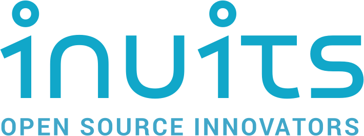

---

# Waarom je niet op vakantie wil naar Logisland.

---

## $ whoami
Lukas Hanot

+++

## In development
* KdG Antwerpen
* TM Geel
* Hackerspace Voidwarranties

+++
## Interesses
* Linux
* Netwerken
* Virtualisatie en containers
* Command Line Interfaces

Note:
- IBM z/OS
- Linux Bash
- Cisco IOS

+++

## Free Open Source Software
* Linux sinds 2012
* Stage Satmarin
* Fosdem, Confmgmtcamp en Loadays

---

## cat /var/log/Stage
- Inuits
- Opdracht: POC Logisland
- Conclusie 

---

### Inuits

Note: 
- Opgericht 2007 
- België, Nederland, Tsjechië en Oekranië

+++

### POC Logisland
Doel: bruikbaarheid van Logisland bepalen

Hoe: Logisland deployen en testen

Note:
Sequentiële patronen 
Events burst
Veel voorkomende patronen
Uitzonderlijke gevallen
Correlatie tussen gebeurtenissen, series & events
+++

### Bevindingen
- Voorbij gestreefd
- Complex  
- Weinig documentatie
- Schaalbaarheid(?)

---

## Andere projecten

+++

### Powershell Deployment

+++

### Project 4.0: FujinIT
- VanRoey
- Locatiebepaling indoors
- Virtualisatie en netwerken

+++

### Git pitch
- Loadays
- Deze presentatie 

---

## Dankwoord
- Inuits & stagementor Kris Buytaert
- Thomas More Hogeschool
- FOSS 
- Stage begeleider Bart Portier
- Opleidingshoofd Ward Kerkhofs

---

## Vragen?

+++

## Contact?
* Mail: Lukas.Hanot@hotmail.com
* Github: https://github.com/LukasHanot/Portfolio
* Portfolio: https://bit.ly/2XZaqCX

+++ 
